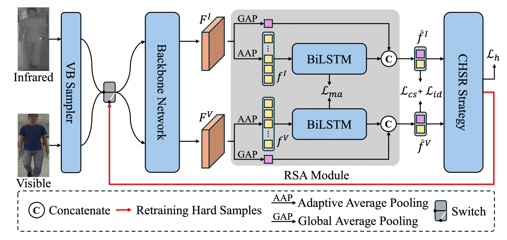

# Semantic Alignment and Hard Sample Retraining for Visible-Infrared Person Re-Identification

## Overview



Visible-Infrared Person Re-Identification (VI-ReID) seeks to match individuals across different modalities. Recent methods focus on discriminative feature extraction and hard sample learning. However, they often suffer from semantic misalignment due to horizontal partitioning in local feature extraction and overlook global hard samples in training. Moreover, the widely used PK Sampler cannot ensure viewpoint balance and diversity. To overcome these limitations, we propose the Semantic Alignment and Hard Sample Retraining (SAHSR) framework. This framework incorporates a Recurrent Semantic Aggregation (RSA) module that progressively aggregates and aligns regional semantics with the help of Modality Alignment loss. Besides, we propose a Confidence-based Hard Sample Retraining (CHSR) strategy that identifies and retrains hard samples to improve the model's robustness. Additionally, we introduce the Viewpoint-Balanced (VB) Sampler to guarantee a balanced distribution of viewpoints. Extensive experiments on VI-ReID benchmarks demonstrate the significant performance gains of our approach, showing state-of-the-art performance.

---

## News

- The code will be available soon.

---


## Getting Started
pip install -r requirements.txt

### Training

1. Download the training data SYSU, unzip and put it in correct position.
2. Change the dataset path in the file `configs/default/dataset.py`
3. Run the 'train.sh' to train the model. 

### Testing
At the end of training, we will automatically test the model. 

---

## Citation

If you use SAHSR in your research, please kindly cite our paper:

```
@inproceedings{jia2024joint,
  title={Semantic Alignment and Hard Sample Retraining for Visible-Infrared Person Re-Identification},
  author={Ni, Jingchen and Lyu, Keyu and Yu, Guo and Yuan, Chun},
  booktitle={2025 IEEE International Conference on Multimedia and Expo (ICME)},
  pages={1--6},
  year={2025},
  organization={IEEE}
}
```

---

## Acknowledgements

We appreciate the support from our collaborators and funding agencies. Stay tuned for updates-the full coderelease will be coming soon!

